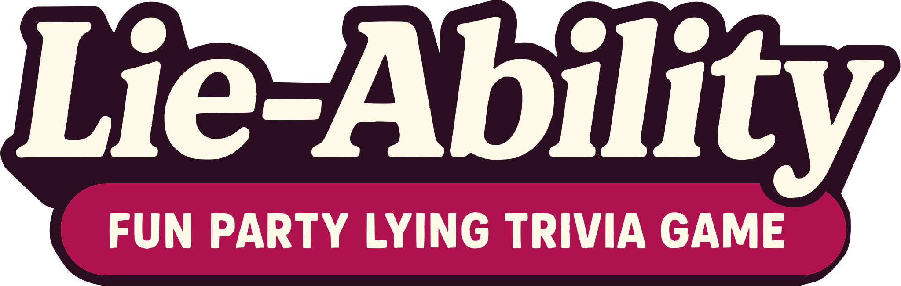

# Lie-Ability

Lie-Ability is a web-based party game of bluffing and trivia. Players compete by inventing plausible lies and trying to guess the truth among fibs, inspired by games like Fibbage and Balderdash. This repo is a prototype version with a built-in debug console and placeholder player/host screens.



---

## Overview

**Lie-Ability** is a local party game for 2–8 players, played with a shared display and each player using their own device. Players make up fake answers to trivia questions and try to spot the truth among the lies.

---

## Features

- **Bluffing Trivia Gameplay**: Each round, players submit fake answers to trivia questions. Players then try to pick the real answer from the mix, earning points for tricking others or finding the truth.
- **Web-based Multiplayer**: Runs on a local Flask web server with real-time communication handled by Flask-SocketIO and Eventlet.
- **Admin/Debug Console**: Powerful debug view for game masters or developers.
- **Category & Rounds**: Questions are grouped by categories and rounds, allowing flexibility for trivia content.
- **Bots Supported**: Host can auto-add bot players for testing/demo.
- **Mobile-Optimized**: Player interface designed for quick, phone-oriented play.
- **Sound Support**: Built-in sound effects for events (see `/static/ding.mp3`).

---

## Quick Start

#### 1. Install Requirements
```bash
pip install flask flask-socketio eventlet
```

#### 2. Run the Server
```bash
python server.py
```

#### 3. Open in Browser

- Open `http://<LAN-IP>:1337/debug` for the debug/host console.
- Open `http://<LAN-IP>:1337/host` as the host screen.
- Players join via `http://<LAN-IP>:1337/player` on their devices.

---

## File Structure

- `server.py` — Main game server and logic.
- `sample.json` — Questions and fake answers database (editable for your own trivia set!).
- `templates/` — Web templates:
  - `debug.html`: Debug/admin console
  - `host.html`: Host screen
  - `player.html`: Player interface
- `static/` — Static files (e.g., sound effects)

---

## How to Add Questions

Edit `sample.json` with your own trivia! Each entry supports:

```json
{
  "category": "History",
  "question": "What famous event…?",
  "answer": "The Truth",
  "lies": ["Plausible Lie 1", "Plausible Lie 2"],
  "audio_file": null
}
```

Organize into `round_one`, `round_two`, etc.

---

## Tech Stack

- Python 3.11+
- Flask (Web)
- Flask-SocketIO (Realtime)
- Eventlet (Async)
- HTML5 + CSS/JavaScript (Client Screens)

---

## Game Flow Overview

1. **Lobby**: Players join and enter names.
2. **Category Choose**: A rotating player picks a question category.
3. **Submit Lies**: Everyone invents and submits their fake answer.
4. **Pick Truth**: All options (one truth, many lies) are shown. Players guess the truth.
5. **Likes**: Players can “like” their favorite lies.
6. **Scoring**: Points and likes are tallied!
7. **Repeat**: Proceeds through rounds and questions with scorekeeping.
8. **End**: Winner is declared.

---

## Status / TODO

- Prototype: Core gameplay works, but UI is placeholder.
- No authentication/security for production!
- Add your own questions in `sample.json`.
- Not currently designed for cloud/web deployment (local only, for now).

---

## License & Contributions

Prototype/demo for educational and party use. Contributions welcome—fork away!

---

> Created with ❤️ for the love of party games, trivia, and bluffing!


