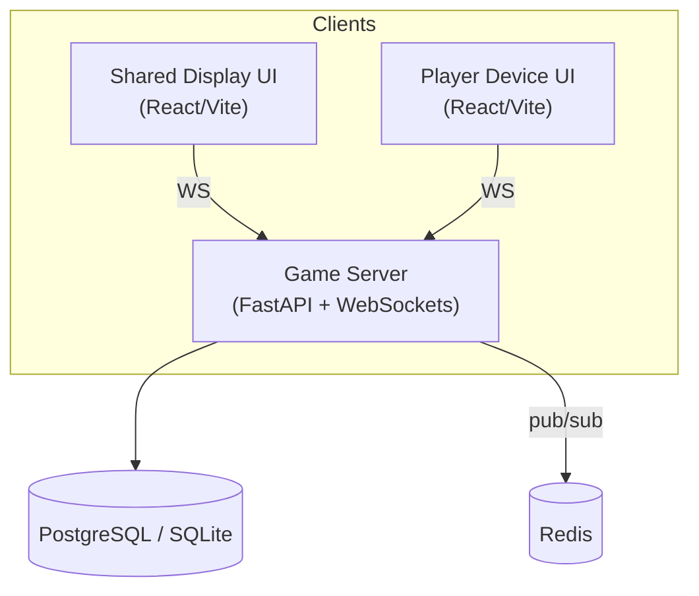
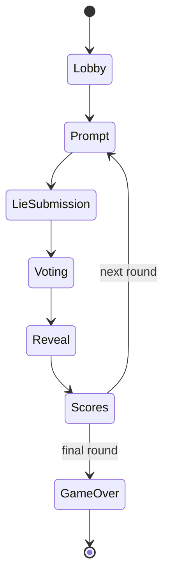

# Architecture

## Overview

Lie‑Ability is a real‑time, bluff‑based trivia game designed to run on a single host machine but be played across many personal devices.  The system is composed of a **Python backend** that maintains game state and a **TypeScript frontend** rendered twice: once as the **Shared Display** (projector/TV) and once per **Player Device** (phones/tablets).  All views communicate with the backend through WebSockets for sub‑second bidirectional updates.

> **Goals**
>
> * Smooth 60 fps display on the Shared Display
> * ≤100 ms round‑trip latency for player actions
> * Easy local dev (`./start.sh`) **or** one‑command Docker deployment (`docker compose up`)

---

## High‑Level System Diagram



* **WS** = secure WebSocket (wss\://) on port 443 or 8001 in dev.
* **MQ** = optional Redis instance to broadcast events when you scale out to multiple server processes.

---

## Components

| Layer                 | Tech                                                         | Purpose                                                                    |
| --------------------- | ------------------------------------------------------------ | -------------------------------------------------------------------------- |
| **Game Server**       | Python 3.12, FastAPI, `uvicorn`, Pydantic, `python‑socketio` | Holds lobby & round state, validates moves, scores rounds, pushes updates. |
| **Shared Display UI** | React 18 + Vite + Tailwind CSS                               | Full‑screen marquee view shown on a TV/projector.                          |
| **Player Device UI**  | React 18 + Vite + Tailwind CSS                               | Responsive touch UI; joins by scanning QR code.                            |
| **Database**          | SQLite (dev/local) → PostgreSQL (prod)                       | Persist user accounts & long‑term stats.                                   |
| **Message Queue**     | Redis (optional)                                             | Horizontal scaling & presence heartbeat.                                   |

---

## Game State Machine



* **Lobby** – players join, choose nicknames & avatars.
* **Prompt** – server selects a trivia prompt and broadcasts it.
* **LieSubmission** – each player submits a bluff (timeout configurable).
* **Voting** – prompts & lies shuffled; players choose an answer.
* **Reveal** – truth exposed, points assigned.
* **Scores** – running tally & winner highlight; repeat or end.

All state changes are emitted over WebSocket events; the client views render purely from the last known state.

---

## Deployment Modes

### 1. Native (macOS/Linux)

```bash
python -m venv .venv && source .venv/bin/activate
pip install -r backend/requirements.txt
cd frontend && npm ci && npm run build
uvicorn backend.main:app --reload  # http://localhost:8000
```

Then open `http://localhost:5173` (player) and `http://localhost:5173/shared` (shared display).

### 2. Docker Compose

```yaml
version: "3.9"
services:
  backend:
    build: ./backend
    env_file: .env
    ports: ["8000:8000"]
    depends_on: [db, redis]
  frontend:
    build: ./frontend
    ports: ["80:80"]
  db:
    image: postgres:16-alpine
    environment:
      POSTGRES_USER: lie
      POSTGRES_PASSWORD: ability
      POSTGRES_DB: lieability
  redis:
    image: redis:7-alpine
```

Run with:

```bash
docker compose up --build
```

The root `start.sh` script automatically chooses **native** if Docker is absent or `-n` is passed, otherwise falls back to **Docker**.

---

## Repository Layout

```
lie-ability/
├── backend/            # FastAPI application
│   ├── main.py
│   ├── game/           # state machine
│   └── tests/
├── frontend/
│   ├── shared/         # Shared Display bundle
│   └── player/         # Player Device bundle
├── docs/               # Project documentation (including this file)
├── start.sh            # Convenience launcher
└── docker-compose.yml
```

---

## Data Flow Sequence (per round)

1. **PromptSelect** – server fetches prompt from `prompts.csv` or DB.
2. **Emit→Prompt** – server → all clients (`prompt` event).
3. **Collect Lies** – clients → server (`submit_lie`).
4. **Emit→ChoiceList** – server shuffles truth + lies, sends `choices`.
5. **Collect Votes** – clients → server (`vote`).
6. **Emit→Reveal** – server calculates points, sends `reveal`.
7. **Emit→Scoreboard** – server updates score & state → clients.
8. Next round or end.

---

## Environment Variables

| Variable       | Default                    | Description                            |
| -------------- | -------------------------- | -------------------------------------- |
| `APP_ENV`      | `dev`                      | `dev` = hot‑reload; `prod` = optimized |
| `DATABASE_URL` | `sqlite:///lieability.db`  | SQLAlchemy DSN                         |
| `REDIS_URL`    | `redis://localhost:6379/0` | Pub/Sub broker                         |
| `SECRET_KEY`   | *generate*                 | JWT & session signing                  |

Place overrides in `.env` (read by both Docker & native launcher).

---

## Development Workflow

1. Write or update a spec in `docs/`.
2. Open a GitHub issue tagged **`codex-task`**.
3. Codex (or a contributor) submits a PR implementing the spec.
4. CI runs `pytest` + frontend unit tests + `prettier --check`.
5. Human review → merge → automatic Docker image build & GitHub Pages deploy of `/docs`.

---

## Future Enhancements

* OAuth sign‑in for persistent user stats.
* “Audience” mode for >8 spectators voting on best lie.
* Voice‑over sound pack & SFX.