# Gameplay

## Overview

Lie‑Ability is a light‑hearted bluff‑and‑guess trivia game for **2 – 8 players**.  Each round delivers an obscure prompt; players must invent a believable lie while spotting the truth themselves. You earn points for:

* **Truth Sleuth** – choosing the real answer.
* **Master Liar** – fooling friends into picking your lie.
* **Ever Clever** – *(optional)* likes from other players.

A standard game lasts **3 rounds** (≈ 15 min), but the host can restart with the same lobby afterwards.

---

## Roles

| Role                    | Device                                | Responsibilities                                                |
| ----------------------- | ------------------------------------- | --------------------------------------------------------------- |
| **Host**                | Shared Display *or* any player device | Creates lobby, selects prompt packs & round count, starts game. |
| **Player**              | Smartphone / tablet / laptop          | Submits lies, casts votes, reacts to reveals.                   |
| **Audience** *(future)* | Phone / tablet                        | Votes for the “best lie” (vanity points only).                  |

---

## Joining a Game
1. Host opens the **Shared Display** (TV/projector) – it shows a QR code containing the lobby URL (LAN‑only or public, configurable).
2. Players scan or type the URL on a personal device.
3. Choose a nickname & avatar (emoji carousel + color wheel). The server blocks duplicate names.
4. Once at least two players join, the host can press the **Start Game** button.

> **Zero‑install onboarding** – everything runs in a mobile browser.

---

## Round Flow

```mermaid
sequenceDiagram
    participant H as Host
    participant P as Players
    Note right of H: Shared Display mirrors server state
    H->>P: Prompt – text & category
    P->>H: Lies (≤ 30 s)
    H->>P: Shuffled choices (truth + lies)
    P->>H: Vote (≤ 20 s) & Like
    H->>P: Reveal ➜ who fooled whom
    H->>P: Scoreboard ➜ cumulative totals
```



| Phase              | Default Timer | Description                                                                                                |
| ------------------ | ------------- | ---------------------------------------------------------------------------------------------------------- |
| **Prompt**         | 5s           | Read‑only; displayed to all.                                                                               |
| **Lie Submission** | 30 s          | Each player types a bluff. Blank→ auto‑lie (e.g., *Justin Bieber*).                                       |
| **Guessing**       | 20 s          | Players see all answers (shuffled) & pick one.<br/>No self‑vote. Likes stay open until everyone has voted. |
| **Reveal**         | 4 s × answers | Shared Display flips cards one‑by‑one with SFX.                                                            |
| **Scores**         | 8 s           | Animated bar chart, then next prompt.                                                                      |

---

## Scoring Algorithm

| Action                           | Base Points   |
| -------------------------------- | ------------- |
| Pick the truth                   | **+500**      |
| Fool a player with your lie      | **+250** each |
| Pick a canned/game‑generated lie | **–500**      |

Round multipliers: × 2 in round 2, × 3 in the final round.

*Tie‑breakers*: If scores tie, the game crowns multiple winners so everyone shares bragging rights!

---

## Prompt Packs

| Pack                 | Description                                  | Items |
| -------------------- | -------------------------------------------- | ----- |
| **Classic Trivia**   | Strange facts, quirky laws, historic firsts  | 200   |
| **Celebrity Tweets** | Real tweets with a missing word/name         | 150   |
| **Movie Bluffs**     | Plot holes & taglines                        | 120   |
| **Custom CSV**       | Bring your own pack (`prompts/yourpack.csv`) | ∞     |

CSV format example:

```csv
category,prompt,answer
"TRIVIA TIME","Mickey Mouse's middle name is _____.","Theodore"
```

The game groups duplicate categories, with each row becoming one prompt.

---

## Edge Cases & Error States

* **Disconnect** – if a player drops, their submitted lie (if any) stays; otherwise the server injects a canned lie. No voting, scoring, or likes accrue to disconnected users that round.
* **Duplicate Lies** – if two players submit identical lies, the server replaces both with a single canned lie to keep choices unique.
* **Timeouts** – missed submissions/votes invoke canned lies or random votes; affected players receive zero points that phase.

---

## Game‑Over Screen

Final standings appear with an animated podium, confetti, and three big buttons:

1. **Play Again** – same players & settings.
2. **New Game** – return to lobby for fresh setup.
3. **Exit** – shuts down the server *(host only)*.

---

## Customisation Flags (`.env` or CLI)

| Flag             | Default | Description                          |
| ---------------- | ------- | ------------------------------------ |
| `LIE_TIMER`      | `30`    | Seconds players have to submit lies. |
| `VOTE_TIMER`     | `20`    | Seconds players have to vote.        |
| `ROUND_COUNT`    | `3`     | Number of rounds per game.           |
| `ALLOW_WAITLIST` | `false` | Enable audience/wait‑list mode.      |

---

## Design Principles

* **Truth‑as‑State** – clients render solely from server‑pushed state; no hidden game logic on the client.
* **Server Authority** – validation (duplicate lies, vote legality, timers) happens server‑side.
* **Spectator‑First** – pacing & animations tuned for a living‑room setting.
* **Zero Friction** – QR boarding, browser‑only play, < 15 min default session.

Enjoy lying to your friends 😈